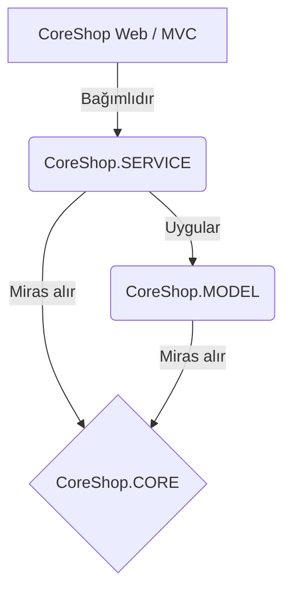

<div align="center">
  # CoreShop 
  **Premium Bilgisayar Bileşenleri E-Ticaret Deneyimi**
  
  [](https://dotnet.microsoft.com/)
  [-blue)](#-mimari)
  [](#-uiux-tasar%C4%B1m%C4%B1)
  [](LICENSE)
</div>

<br/>

**CoreShop**, bilgisayar bileşenleri satışı için geliştirilmiş, **ASP.NET Core 8.0 MVC** tabanlı yüksek performanslı bir e-ticaret web uygulamasıdır. 

Sıradan temaların ötesine geçerek **"Soft Premium"** (Apple sadeliğinde) özel bir arayüz tasarımı sunar. Minimalizm, devasa tipografiler ve yüksek kaliteli ürün sergilemeye odaklanır.

Bu proje bir portfolyo çalışması olarak **"Sıfır Kurulum"** prensibiyle tasarlanmıştır. Veritabanı veya SQL Server kurulumuna gerek kalmadan, uygulama çalıştırıldığı anda tüm veriler in-memory (bellek içi) olarak yüklenir ve hemen test edilebilir.

---

## ✨ Öne Çıkan Özellikler

- 🎨 **"Soft Premium" Arayüz:** Apple tarzı minimalist ürün sergileme, devasa fontlar, cam efekti (glassmorphism) ve kusursuz gölgelendirmeler.
- 🛒 **Tam Kapsamlı E-Ticaret:** Kategori filtreleme, detaylı ürün sayfaları, stok takibi ve Session (oturum) tabanlı çalışan gelişmiş alışveriş sepeti.
- 🔐 **Rol Tabanlı Yetkilendirme:** Cookie tabanlı güvenli giriş sistemi (Kullanıcı ve Admin rolleri).
- 📦 **Sipariş Yönetimi:** Teslimat ekranları, simüle edilmiş ödeme adımı ve anlık sipariş durumu takibi.
- 🎛️ **Admin Paneli:** Ürün, kategori ve siparişleri yönetebileceğiniz; stok seviyesi 5'in altına düşen ürünleri bildiren akıllı kontrol paneli.
- 🚀 **Anında Çalışan Altyapı:** 10 Kategori, arka planı temizlenmiş (transparent PNG) 38 gerçek ürün ve örnek siparişlerle birlikte gelir.

## 🚀 Hızlı Başlangıç

CoreShop'u bilgisayarınızda çalıştırmak sadece saniyeler sürer. **Hiçbir veritabanı ayarı yapmanıza gerek yoktur.**

```bash
# Projeyi klonlayın
git clone https://github.com/awqken/E-Ticaret-Core-Shop.git

# Proje dizinine girin
cd CoreShop

# Uygulamayı çalıştırın
dotnet run --project CoreShop
```
Uygulama başladığında `http://localhost:xxxx` adresini tarayıcınızda açın. Tüm veriler yüklenmiş olarak sizi bekliyor olacak!

### 🔑 Demo Hesaplar

| Rol | E-Posta | Şifre |
|------|-------|----------|
| **Yönetici (Admin)** | `admin@coreshop.com` | `Admin123` |
| **Kullanıcı** | Yeni bir hesap açabilir veya ziyaretçi olarak takılabilirsiniz | - |

## 🏗️ Mimari

CoreShop, kodun yönetilebilirliğini ve sürdürülebilirliğini sağlamak için temiz bir **Katmanlı Mimari (N-Tier)** kullanır:



- **CoreShop (Web):** Controller'ları, View'ları (Razor) ve ViewModel'leri içeren sunum katmanı.
- **CoreShop.SERVICE:** İş kurallarının uygulandığı ve in-memory veri deposunun bulunduğu katman.
- **CoreShop.MODEL:** Veritabanı tablolarına karşılık gelen varlıklar (Product, Category, Order vb.).
- **CoreShop.CORE:** Soyutlamalar, temel sınıflar ve `ICoreService<T>` gibi jenerik interfaceler.

*(Not: Web katmanı verilerin nereden geldiğini bilmez. Gelecekte gerçek bir veritabanına (SQL Server) geçiş yapılmak istendiğinde Controller dosyalarına tek bir satır kod yazmaya gerek kalmayacaktır.)*

## 🎨 UI/UX Tasarımı (v1.2 ile Yenilendi)

CoreShop'un en son sürümü, standart bootstrap temalarını çöpe atarak devasa bir **"Soft Premium"** tasarım diline geçmiştir:
- **Hero (Karşılama) Ekranı:** Tamamen şeffaf arka plan üzerine oturtulmuş, derin gölgelendirmelere sahip devasa bir RTX 5090 görseli.
- **Duyarlı Düzen:** Ziyaretçiyi karşılayan o ilk ekranın (scroll yapmaya gerek kalmadan) cihazın ekranına milimetrik sığmasını sağlayan kusursuz Flexbox (100vh) mimarisi.
- **Güven Bandı (Stats):** Tasarımın en altına sabitlenmiş, Apple kalitesinde minimal istatistikler ve güven mesajları (Örn: 5000+ Premium Ürün, %100 Müşteri Desteği).

## 📄 Lisans

Bu proje tamamen açık kaynaktır ve MIT Lisansı ile lisanslanmıştır. İnceleyebilir, geliştirebilir veya kendi portfolyonuz için ilham alabilirsiniz.
